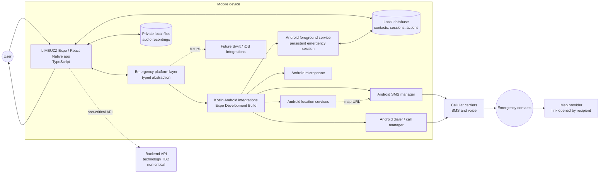
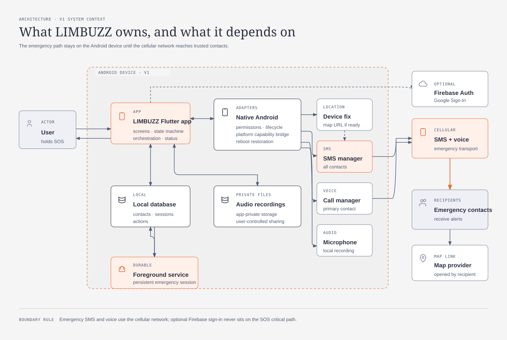
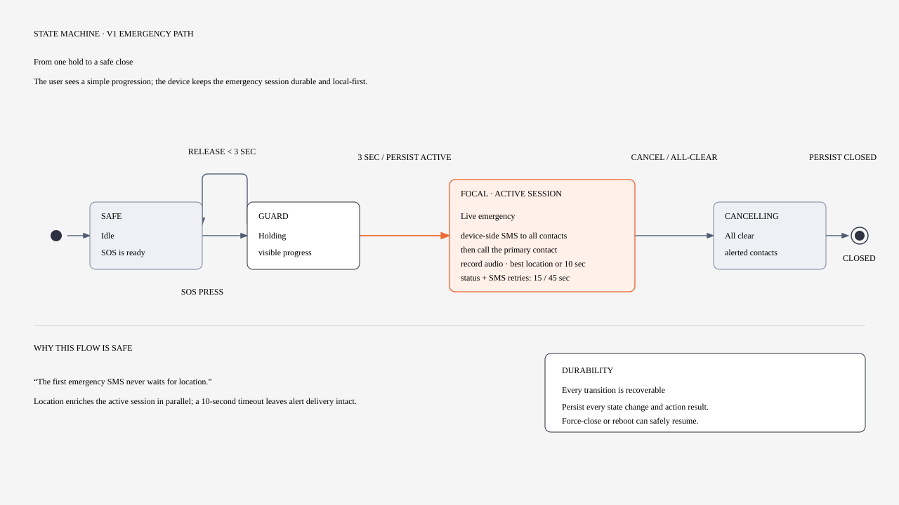
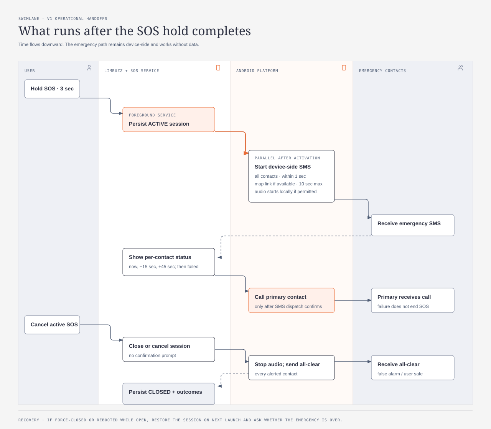
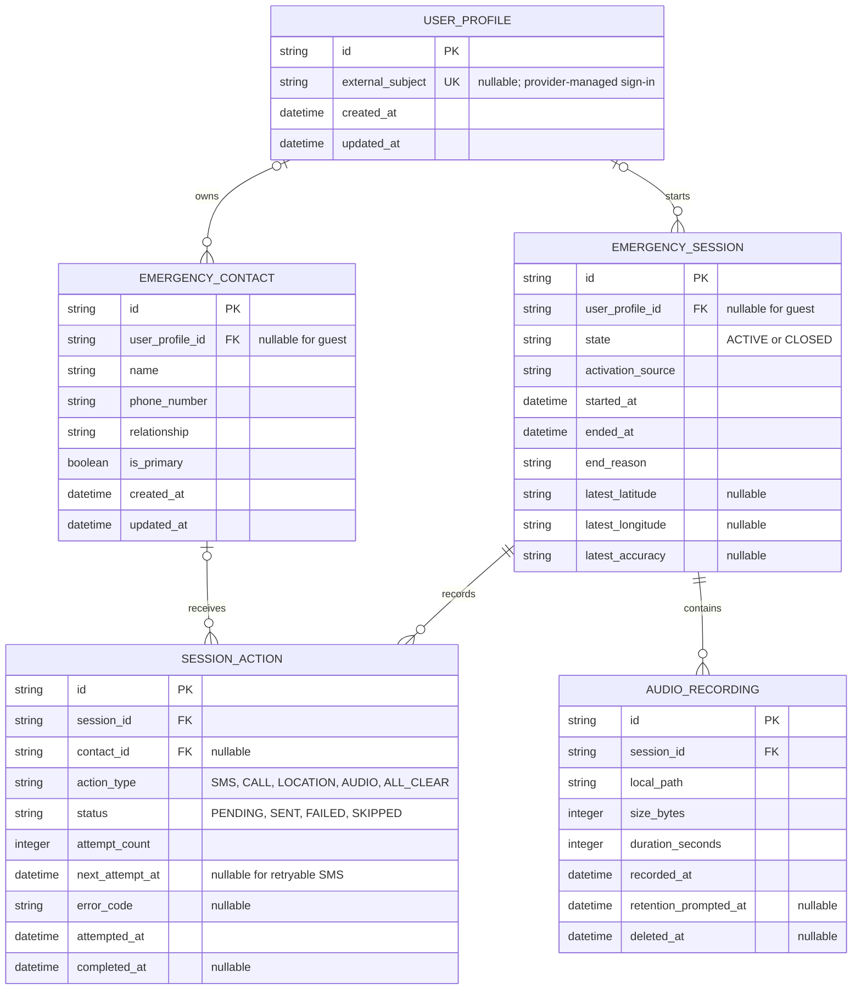

# LIMBUZZ V1 Architecture

This document translates the V1 product requirements into an implementation-level mobile architecture. It is Android-first for the controlled pilot, but the app layer and platform boundary are designed to support iOS later.

## Diagram exports

The system context and local data model remain inline Mermaid. The system context also has an icon-assisted companion export, while the SOS emergency flow and V1 build boundary are maintained as editable HTML with standalone SVG exports.

- [V1 build boundary source HTML](diagrams/v1-boundary.html)
- [V1 build boundary SVG](diagrams/v1-boundary.svg)
- [V1 system context source HTML](diagrams/system-context.html)
- [V1 system context SVG export](diagrams/system-context.svg)
- [SOS emergency flow source HTML](diagrams/sos-emergency-sequence.html)
- [SOS emergency flow SVG export](diagrams/sos-emergency-sequence.svg)
- [SOS operational flow source HTML](diagrams/sos-emergency-operation.html)
- [SOS operational flow SVG export](diagrams/sos-emergency-operation.svg)

## Architecture principles

- The emergency path is local-first and must not depend on internet access.
- Emergency SMS is sent by the device through the native Android SMS stack.
- SMS dispatch happens before the primary-contact call.
- An active emergency is a persisted session owned by an Android foreground service.
- Location and audio are used only during an active emergency.
- The app layer uses React Native, Expo, and TypeScript; Expo Development Builds are the native-capability boundary.
- Emergency platform capabilities sit behind a typed abstraction: Kotlin/native Android integrations are implemented first, with Swift/native iOS integrations added later.
- A Backend API is technology-agnostic and TBD behind a typed API boundary; it is never a dependency of the critical offline SOS path.
- No V1 gateway SMS, push notification service, or cloud media storage is required for SOS.

## How V1 works at a glance

A user opens LIMBUZZ and holds SOS for three seconds. The app saves the emergency session, starts the Android foreground service, begins location capture and local audio where permission allows, and sends an emergency SMS from the device to every configured contact. SMS retries and delivery status are tracked independently. After SMS dispatch begins, LIMBUZZ calls the primary contact. The user can cancel at any time; cancellation sends an all-clear to every contact already alerted. If the app is force-closed or the phone reboots, the open session is restored when the app starts again.

## 1. V1 system context

Editable source: [V1 system context HTML](diagrams/system-context.html). This icon-assisted SVG is a companion view of the Mermaid diagram above; it does not replace or change the Mermaid source.

### System boundary

The React Native + Expo application owns the UI, navigation, contacts management, SOS state/UI, local-data access, authentication UI, settings, shared business logic, validation, orchestration, and user-visible status. A typed Emergency Platform Layer separates that shared app code from native capabilities. Kotlin/native Android integrations implement SMS dispatch, calls, location, microphone access, foreground-service lifecycle, reboot restoration, and permission state in Expo Development Builds. Future Swift/native iOS integrations implement the iOS-compatible platform contract without changing the shared app layer.

The cellular network is the emergency transport. The Backend API is technology TBD behind a typed API boundary and remains outside the critical offline SOS path; the app must continue to activate and run SOS when it is unavailable.

## 2. SOS emergency flow

### What happens when SOS is pressed

1. The user holds the SOS control for three seconds. Releasing it earlier cancels activation without side effects.
2. At three seconds, LIMBUZZ persists the emergency session and starts the Android foreground service. Audio recording begins immediately when microphone permission is available, and location capture starts in parallel.
3. The device sends an emergency SMS to every configured contact. It does not wait for the audio recording or a perfect location fix; if no location is ready by ten seconds, the alert continues without it.
4. After SMS dispatch begins, LIMBUZZ calls the primary contact. Audio continues while the emergency session is active, and SMS retries and per-contact status are shown independently.
5. The recording stays in the app’s private device storage. It is not automatically sent to contacts, uploaded, or placed in the cloud.
6. When the user cancels or ends the emergency, recording stops, the session closes, and an all-clear SMS goes to every contact already alerted.
7. If the app is force-closed or the phone reboots while the session is open, LIMBUZZ restores the session on the next launch and asks whether the emergency is over.

Editable source: [SOS emergency flow HTML](diagrams/sos-emergency-sequence.html). The SVG is a standalone export of that source.

### Detailed operational flow

This companion swimlane shows which actor owns each step after the hold completes. It complements the state flow above; it does not replace the runtime rules below.

### Important runtime rules

1. Releasing the control before three seconds does nothing.
2. Location collection never blocks the first SMS; ten seconds is the maximum wait.
3. The first SMS is dispatched before the primary-contact call.
4. Each contact gets an independent retry schedule: immediately, after 15 seconds, and after 45 seconds.
5. Any one failure is recorded and shown without stopping the rest of the sequence.
6. Cancel sends an all-clear to every contact already alerted, without a confirmation prompt.
7. Every state transition and action result is persisted so force-close and reboot recovery can resume safely.
8. Audio recording begins on activation where permission allows; it runs locally and does not block alert delivery.

## 3. Local data model

### Persistence notes

- `user_profile_id` remains nullable so guest mode is a first-class state.
- Contacts and sessions are readable without connectivity.
- Audio files remain in app-private device storage until the user explicitly shares or deletes one.
- The database is the source of truth for recovery; in-memory state is only a live projection for the UI.
- Retryable actions persist their next attempt time so a force-close or reboot cannot lose the SMS retry schedule.
- A future sign-in links existing guest data instead of replacing it; its provider remains outside the SOS platform contract.

## 4. Build boundary for V1

## 5. Open implementation decisions

- Select and validate an Expo-compatible local database package against Android API 24 and low-end devices.
- Define the typed Backend API boundary and choose its implementation technology later without making it a dependency of SOS.
- Implement the Kotlin Android modules through Expo Development Builds and keep the Swift/iOS adapter contract ready for the later platform.
- Decide the audio storage cap before implementing the recording feature.
- Finalize emergency and all-clear message copy before SMS implementation.
- Create and back up the Android release keystore for Expo Development Builds and the controlled APK pilot.
- Confirm Android OEM behavior for foreground-service permissions, reboot receivers, SMS, calls, and battery optimization; document the corresponding iOS capability differences before adding Swift integrations.
