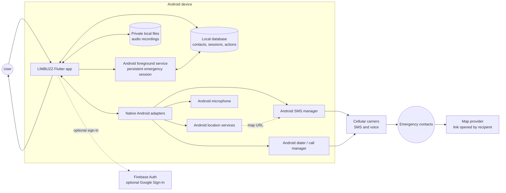
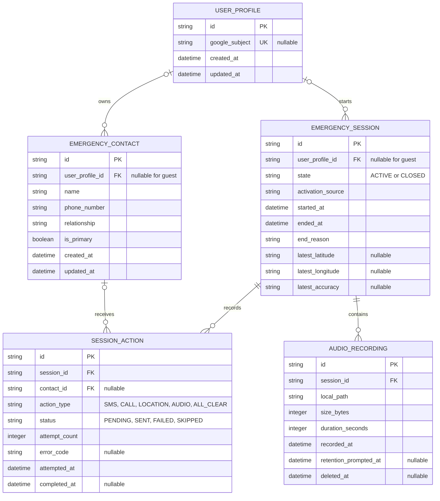
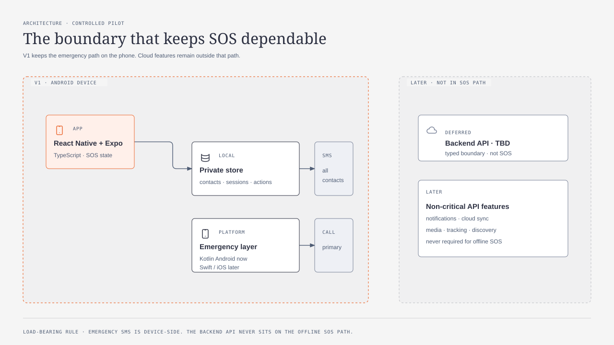

# LIMBUZZ V1 Architecture

This document translates the V1 product requirements into an implementation-level architecture. It is intentionally limited to the controlled Android pilot.

## Diagram exports

The system context and local data model remain inline Mermaid. The SOS sequence is maintained as an editable Koboyo diagram, and the V1 build boundary is available as a local SVG.

- [V1 build boundary SVG](diagrams/v1-boundary.svg)
- [SOS sequence in Koboyo](https://koboyo.com/edit/bippy-technical-architecture-px2cv9)

## Architecture principles

- The emergency path is local-first and must not depend on internet access.
- Emergency SMS is sent by the device through the native Android SMS stack.
- SMS dispatch happens before the primary-contact call.
- An active emergency is a persisted session owned by an Android foreground service.
- Location and audio are used only during an active emergency.
- Firebase is optional authentication infrastructure, not a dependency of the emergency path.
- No V1 application backend, gateway SMS, push notification service, or cloud media storage.

## 1. V1 system context

### System boundary

The Flutter application owns screens, validation, the SOS state machine, orchestration, and user-visible status. Native Android adapters own platform capabilities that Flutter cannot guarantee by itself: SMS dispatch, calls, location, microphone access, foreground-service lifecycle, reboot restoration, and permission state.

The cellular network is the emergency transport. Firebase is outside the critical path and may be unreachable, unavailable, or unused.

## 2. SOS emergency sequence

<picture>
  <source media="(prefers-color-scheme: dark)" srcset="https://koboyo.com/e/c748e1d3-b8db-4766-8695-7e7107583d0b/de46e9fd-2629-4303-9f6d-5e0832064a4c.svg?theme=dark">
  
</picture>

Editable version: [Koboyo SOS Emergency Flow](https://koboyo.com/edit/bippy-technical-architecture-px2cv9)

### Important runtime rules

1. Releasing the control before three seconds does nothing.
2. Location collection never blocks the first SMS; ten seconds is the maximum wait.
3. The first SMS is dispatched before the primary-contact call.
4. Each contact gets an independent retry schedule: immediately, after 15 seconds, and after 45 seconds.
5. Any one failure is recorded and shown without stopping the rest of the sequence.
6. Cancel sends an all-clear to every contact already alerted, without a confirmation prompt.
7. Every state transition and action result is persisted so force-close and reboot recovery can resume safely.

## 3. Local data model

### Persistence notes

- `user_profile_id` remains nullable so guest mode is a first-class state.
- Contacts and sessions are readable without connectivity.
- Audio files remain in app-private device storage until the user explicitly shares or deletes one.
- The database is the source of truth for recovery; in-memory state is only a live projection for the UI.
- A future sign-in links existing guest data instead of replacing it.

## 4. Build boundary for V1

## 5. Open implementation decisions

- Select and validate the Flutter local database package against API 24 and low-end devices.
- Decide the audio storage cap before implementing the recording feature.
- Finalize emergency and all-clear message copy before SMS implementation.
- Create and back up the Android release keystore; register development and release SHA-1 fingerprints with Firebase.
- Confirm Android OEM behavior for foreground-service permissions, reboot receivers, SMS, calls, and battery optimization.
